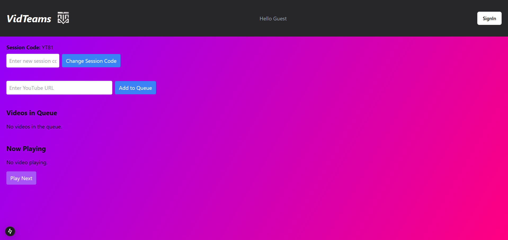
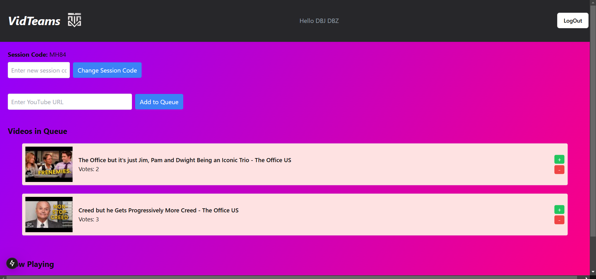
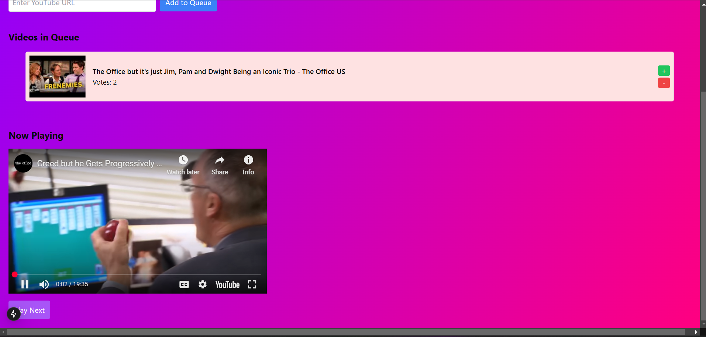

# VidTeams

**VidTeams** is a web application for teams and friends to stream videos and songs together and decide what to play next. Users vote on the next media, with the majority choice winning—unless someone is willing to pay to change the rankings.😊

---

## Table of Contents

- [Overview](#overview)
- [Features](#features)
- [Installation](#installation)
- [Usage](#usage)
- [Screenshots](#screenshots)
- [License](#license)

---

## Overview

VidTeams offers a collaborative experience for sharing media. Whether you're hosting a virtual hangout or managing a team break, VidTeams makes it easy to synchronize your viewing and listening experience. The built-in voting system ensures that everyone has a say in what plays next,<i><b>and there's even an option to override the vote with a monetary contribution.</b></i>

---

## Features

- **Group Streaming:** Simultaneously stream videos and songs for groups.
- **Voting System:** Vote on the next video or song to play; the most popular choice wins.
- **Override Option:** Influence the voting outcome by paying to change the rankings.
- **User-Friendly Interface:** Enjoy a simple and intuitive design that makes collaboration easy.
- **Real-Time Updates:** Watch the playlist update live as votes are cast.

---

## Installation

### Prerequisites

- [Node.js](https://nodejs.org/) (version 12 or above)
- npm (or pnpm)

### Steps to Install

1. **Clone the Repository:**
```
   git clone https://github.com/yourusername/VidTeams.git
```


## Usage

Once you open VidTeams in your browser:

1. **Open Your Browser:**
   - Navigate to your web application's URL.

2. **Create or Join a Session:**
   - Start a new streaming session or join an existing one using a session code.

3. **Add Media to the Playlist:**
   - Enter YT url and Add to Queue.

4. **Vote on the Next Media:**
   - Participants can vote for the media they want to play next. The media with the most votes will be played.
   - Optionally, users can use the override feature by contributing funds to alter the ranking.

5. **Enjoy the Stream:**
   - Sit back and enjoy a synchronized streaming experience with your friends or team.

---

## Screenshots

*(Replace the placeholder paths with your actual screenshots)*

- **Home Screen:**
  
  


- **Voting Interface:**
  
  

- **Now Playing:**
  
  

---
## Remeber to add Node Modules and a config.tsx

app -> components -> <i>add </i> config.tsx

```
export const config = {
    NEXTAUTH_SECRET: "xxxxxxxxxxxxxxxxxxxxxxxxxxxxxxxxxxxxxxxxxx",
    NEXTAUTH_URL: "xxxxxxxxxxxxxxxxxxxxxxxxxxxxxxxxxxxxx",
    GOOGLE_CLIENT_ID: "xxxxxxxxxxxxxxxxxxxxxxxxxxxxxxxxxxxxxxxxxx",
    GOOGLE_CLIENT_SECRET: "xxxxxxxxxxxxxxxxxxxxxxxxxxxxxxxxxxxxxx",
    SPOTIFY_CLIENT_ID:"xxxxxxxxxxxxxxxxxxxxxxxxxxxxxxxxxx",
    SPOTIFY_CLIENT_SECRET:"xxxxxxxxxxxxxxxxxxxxxxxxxxxxxxxxxxx",
    YOUTUBE_API:"xxxxxxxxxxxxxxxxxxxxxxxxxxxxxxxxxxxxxxxxxxx",
  };
```


## License

This project is licensed under the [MIT License](LICENSE).